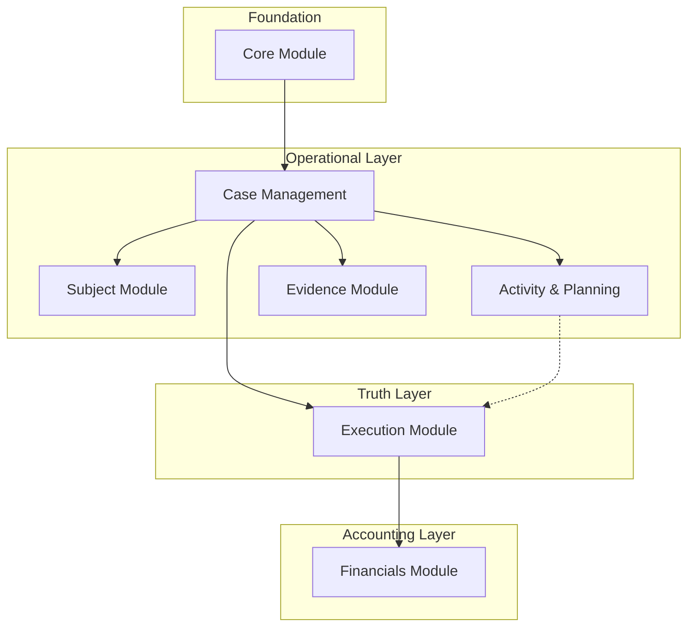

# CaseWyze Technical Implementation Plan

## 1. System Overview & Module Architecture

This document outlines the technical implementation plan for **CaseWyze**, adhering strictly to the "Technical Implementation Brief". The system is architected around the "Updates as Ground Truth" principle, ensuring investigative integrity and accurate billing.

### High-Level Module Dependency Graph

---

## 2. Module Details

### Module 1: Core Foundation
**Data Owners:** `Organization`, `User`
**Purpose:** Provides the multi-tenant secure operational boundary.

*   **Key Responsibilities:**
    *   Authentication & Authorization (Role-Based Access).
    *   Organization context enforcement (All queries *must* filter by `organization_id`).
    *   User Profile management.
*   **Database Mapping:**
    *   `Organization` $\rightarrow$ `public.organizations`
    *   `User` $\rightarrow$ `auth.users` + `public.profiles` + `public.organization_members`
*   **Critical Invariant:** Zero cross-organization access. Best enforced via RLS.

### Module 2: Case Management
**Data Owners:** `Case`
**Purpose:** The central container for all investigative work.

*   **Key Responsibilities:**
    *   Case Lifecycle State Machine (Open -> On Hold -> Closed).
    *   Anchoring all other operational data.
    *   Budget tracking (cached/derived).
*   **Database Mapping:**
    *   `Case` $\rightarrow$ `public.cases`
*   **Critical Invariant:** Every operational record (Task, Update, Expense) *must* link to a `case_id`.

### Module 3: Subject Management
**Data Owners:** `Subject`
**Purpose:** Managing the "Who", "What", and "Where" of investigations.

*   **Key Responsibilities:**
    *   Unified storage of People, Vehicles, Businesses.
    *   Linking subjects to Cases.
*   **Database Mapping:**
    *   `Subject` $\rightarrow$ `public.case_subjects`
*   **Critical Invariant:** A Subject belongs to exactly one Case. Do *not* share subjects across cases (copy if necessary) to maintain case isolation integrity.

### Module 4: Activity & Planning
**Data Owners:** `Event`, `Task`
**Purpose:** Forward-looking planning and simple to-do lists.

*   **Key Responsibilities:**
    *   **Events**: Scheduled occurrences (Surveillance, Meetings). *Note: Events are strictly for planning.*
    *   **Tasks**: Checklist items for investigators.
*   **Database Mapping:**
    *   `Task` $\rightarrow$ `public.case_activities` (where `activity_type = 'task'`)
    *   `Event` $\rightarrow$ `public.case_activities` (where `activity_type = 'event'` or `is_scheduled = true`)
*   **Critical Invariant:** **Events do not generate billing.** Completing an event does *not* create a billable item. It must prompt the creation of an **Update**.

### Module 5: Execution (The Ground Truth)
**Data Owners:** `Update`
**Purpose:** The single source of truth for what actually happened.

*   **Key Responsibilities:**
    *   Narrative logging of investigative work.
    *   Linking to Subjets and Events.
    *   Triggering the billing workflow.
*   **Database Mapping:**
    *   `Update` $\rightarrow$ `public.case_updates`
*   **Critical Invariant:** Updates are the *only* place where "Work" is officially recorded.

### Module 6: Financials
**Data Owners:** `TimeEntry`, `Expense`
**Purpose:** Downstream accounting artifacts derived from work.

*   **Key Responsibilities:**
    *   Billable time tracking.
    *   Reimbursable expense tracking.
    *   Invoicing generation.
*   **Database Mapping:**
    *   `TimeEntry` $\rightarrow$ `public.case_finances` (type=`time`)
    *   `Expense` $\rightarrow$ `public.case_finances` (type=`expense`)
*   **Critical Invariant:** **Update-First Billing.** Users should ideally create Time Entries *from* an Update to ensure the narrative matches the billed time.

### Module 7: Evidence
**Data Owners:** `Attachment`
**Purpose:** Digital asset management.

*   **Key Responsibilities:**
    *   Secure file storage.
    *   Chain of custody (Audit Log).
*   **Database Mapping:**
    *   `Attachment` $\rightarrow$ `public.case_attachments`

---

## 3. Implementation Plan: Where to Start?

Since you already have a working application shell, your goal is to **align** the existing codebase with the strict invariants of the Brief.

### Phase 1: The Integrity Check (Foundation)
**Goal:** Ensure the "Case Anchor" rule is unbreakable.
1.  **Audit RLS Policies:** Verify `supabase/migrations` to ensure every single table (`cases`, `case_activities`, `case_updates`, `case_finances`) has RLS enforcing `organization_id`.
2.  **Verify Case Linkage:** Check that `case_finances` and `case_activities` cannot be created without a `case_id`.

### Phase 2: The "Update-First" Workflow (Critical Path)
**Goal:** Implement the primary value proposition of CaseWyze.
*This is the recommended starting point for active development.*
1.  **Refactor `NewCaseUpdate.tsx`:**
    *   Ensure that when an Update is saved, the user is immediately prompted (or has inline options) to "Add Billable Time" or "Add Expense".
    *   Auto-fill the `TimeEntry` narrative from the `Update` summary.
2.  **Decouple Events from Billing:**
    *   Check `Activities.tsx` or `Calendar.tsx`. Ensure that "Completing" an event (checking it off) does **not** auto-generate a billable time entry. It should instead prompt: *"Did this happen? Create an Update."*

### Phase 3: Domain Object Mapping
**Goal:** Clean up the "Legacy Naming" issue in the Frontend.
1.  Create a unified Frontend Data Layer (e.g., in `src/types/` or `src/services`) that exposes strict interface names:
    *   `interface Task` (no generic 'activity')
    *   `interface Event`
    *   `interface TimeEntry`
2.  Map these strictly to the underlying Supabase tables (`case_activities`, `case_finances`) so the UI components speak the language of the Brief.

### Phase 4: Financial Rigor
**Goal:** Lock down billing.
1.  Ensure `TimeEntries` are locked (read-only) once their parent `Update` or `Case` is closed/invoiced.
2.  Implement the `AuditLog` for any changes to financial records.

## Summary Recommendation
**Start with Phase 2 (The "Update-First" Workflow).**
This is the core differentiator of CaseWyze. The generic "CRUD" for Cases and Subjects largely exists. The specific logic of "I did work (Update) $\rightarrow$ Therefore I bill (TimeEntry)" is likely the missing link in a generic app structure.
